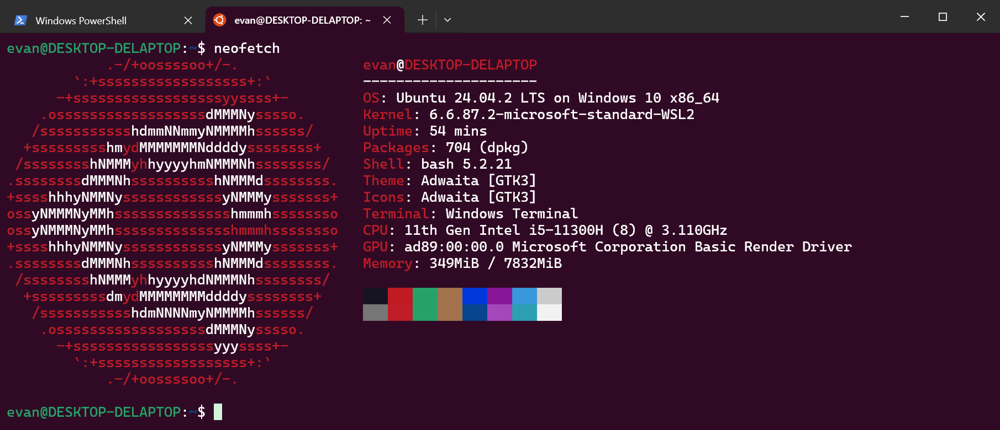
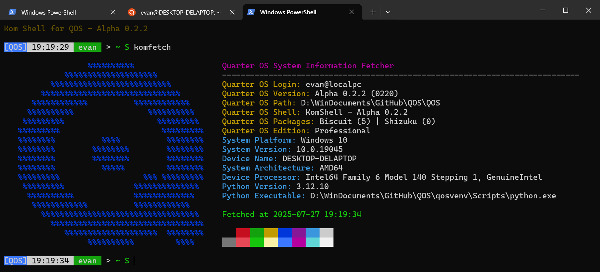

<div align="center">

# KomFetch

一款适用于Quarter OS的快速查看系统信息的第三方应用程序。


</div>

## 介绍

KomFetch是一款适用于**Quarter OS**的快速查看系统信息的第三方应用程序。

它的功能类似于Linux上的 `neofetch` 应用程序：



## 截图



## 用处

### Quarter OS 系统信息

- `Quarter OS Login` : 当前登录的用户 (用户名-主机名)
- `Quarter OS Version` : Quarter OS 系统版本 (版本号|版本代码)
- `Quarter OS Path` : Quarter OS 系统路径 (工作目录)
- `Quarter OS Shell` : 当前使用的Shell (目前只能是KomShell)
- `Quarter OS Packages` : 已安装的软件包数量 (Biscuit & Shizuku)
- `Quarter OS Edition` : 系统激活版本 (如果未激活则为空)

### 宿主机系统信息

- `System Platform` : 宿主机系统平台 (Windows|Linux|MacOS 系统版本)
- `System Version` : 宿主机系统版本 (具体的发行版本号)
- `Device Name` : 设备名称 (如：DESKTOP-123456789)
- `System Architecture` : 系统架构 (如：AMD64/aarch64)
- `Device Processor` : 设备处理器 (可能不是具体名称)

### Python 环境信息

- `Python Version` : Python 版本 (如：3.8.5)
- `Python Executable` : Python 路径 (如：C:\Python38\python.exe)

## 使用方法

在 Quarter OS 终端中，使用 `Biscuit` 软件包管理器获取 `komfetch` 软件包：

```bash
biscuit get komfetch
```

安装完成后，在终端中输入 `komfetch` 即可运行该程序。

```bash
komfetch
```

## 注意事项

- 目前仅支持 `Quarter OS` Python伪系统。

---

<div align="center">

Written by [ElofHew](https://github.com/ElofHew)

&copy; 2025 [Oak Studio](https://os.drevan.xyz/). All rights reserved.

</div>